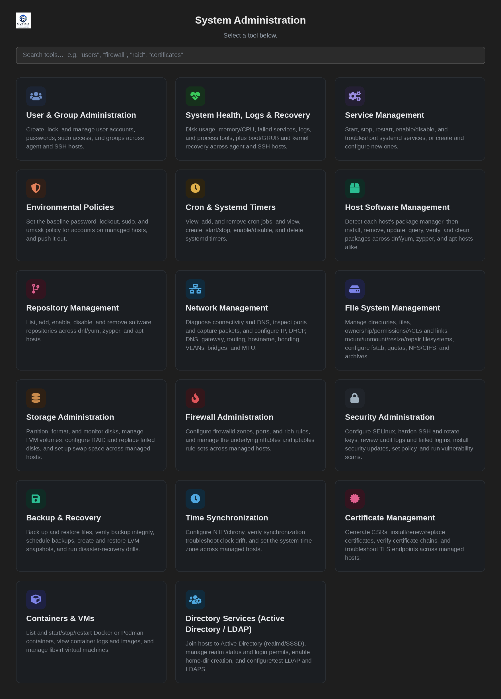
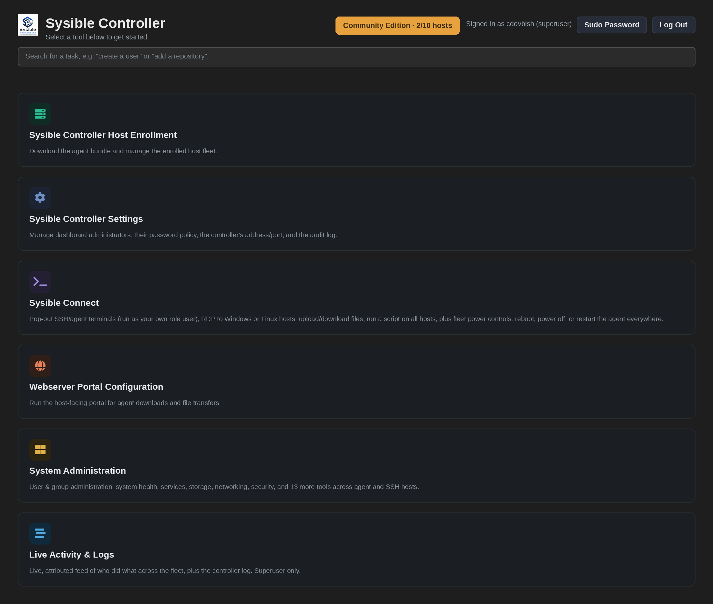
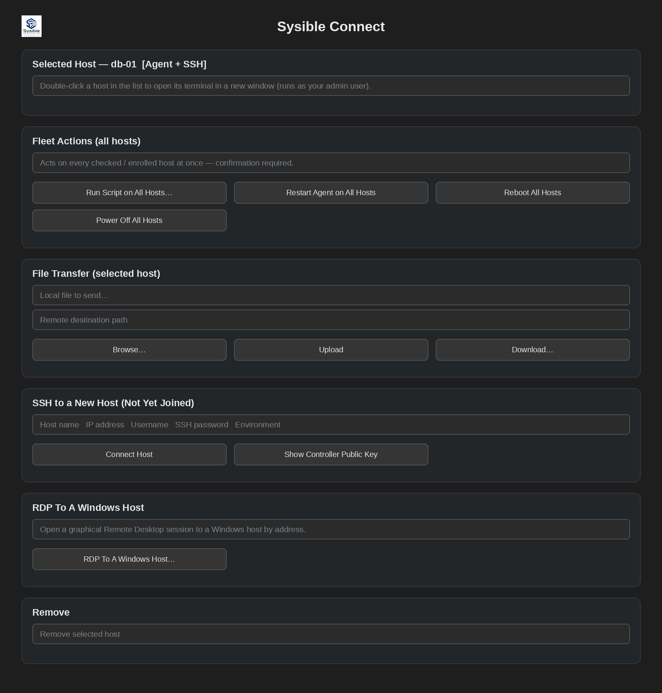
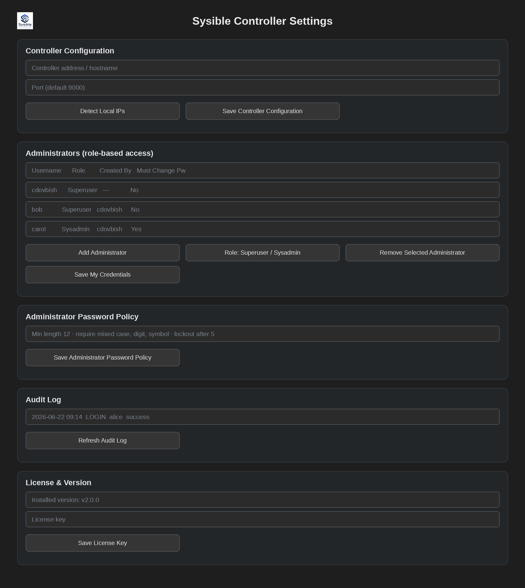
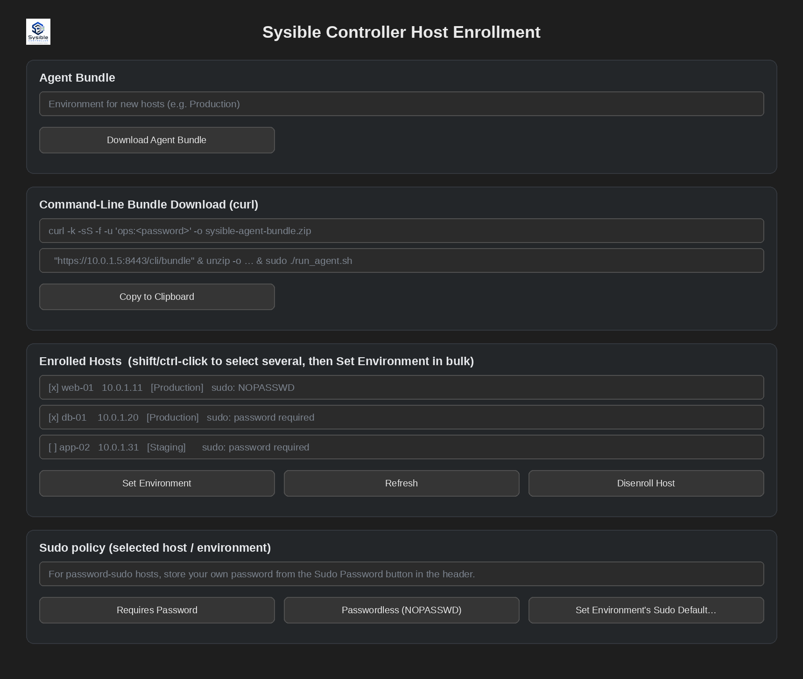
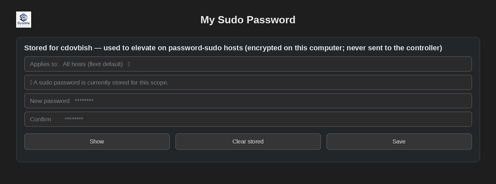
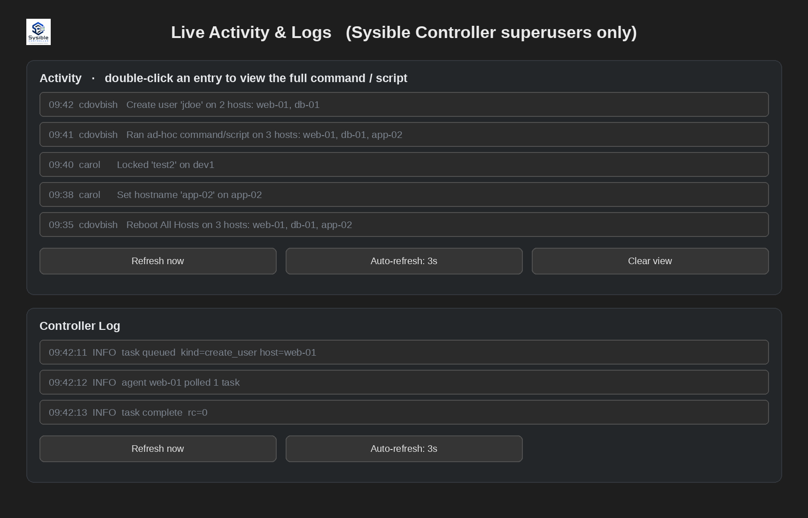

# Sysible Controller

**IT Infrastructure Management Software for Linux fleets — one console, agent or SSH, no DSL to learn.**

Sysible Controller is a self-hosted infrastructure management console for Linux system administrators and engineers. One controller, installed on a single Linux machine, gives you a single point of control over an entire fleet of Linux hosts — user and group administration, health diagnostics, service control, scheduled jobs, package and repository management, networking, storage and filesystem management, firewall and security hardening, and a live remote terminal — whether each host runs Sysible's lightweight agent or is reached directly over SSH.



> The **System Administration** panel: eighteen point-and-click tools — users and groups, health/logs/recovery, services, storage, networking, firewall, security, containers, directory services, and more — each acting across your whole fleet of agent and SSH hosts.

## Overview

Sysible Controller is made up of two cooperating pieces:

- A **FastAPI backend** that runs as a systemd service on the controller machine, holding the fleet's inventory, credentials, and task queue in a local SQLite database.
- A **PySide6 desktop GUI** that an administrator runs to drive that backend over HTTPS.



It manages target hosts through two interchangeable mechanisms, and a single fleet can mix both freely:

- **The Sysible agent** — a small Python daemon installed on a host as its own systemd service, heartbeating back to the controller and polling for queued work. It runs as root by default; an opt-in install flag (`./run_agent.sh --unprivileged`) instead runs it as a dedicated, locked `sysible` system account with passwordless sudo, so the service isn't a root login and its actions go through a sudo audit trail.
- **Direct SSH** — for hosts that shouldn't run a persistent agent. Hand the controller SSH credentials once; it generates and installs its own key pair on the host and drives it directly from then on, including a real interactive terminal session.

Both paths feed the exact same fleet-wide tools, so day to day you don't think about which transport a given host uses.



> Sysible Connect: the host list stays a plain list; the actions are grouped on the right — Fleet Actions (run a script or reboot/power-off/restart the agent across the fleet), file transfer, SSH-enroll a new host, and RDP to a Windows host.

**Every action runs as the administrator who triggered it.** When the operator logged in as `cdovbish` runs a command, the agent executes it as the local `cdovbish` account on the target host (`runuser -u cdovbish`), with exactly that user's sudo rights — not as a faceless root daemon. Privileged steps are tried unprivileged first (so reads succeed without sudo), then escalated only when the OS reports a privilege error. The run-as identity is derived from the administrator's signed login token on the controller, never from anything the client can spoof, so the host's own sudo policy and audit trail stay meaningful. Hosts whose sudo requires a password are fully supported too — see **Sudo modes** below.

A separate, optional **Webserver Portal** gives host operators — not Sysible administrators — a self-service way to grab the agent bundle or exchange files with the controller from a browser, without ever needing GUI or shell access.

## Why Sysible Controller

Most of the Linux infrastructure tooling landscape pulls administrators toward one of two extremes: heavyweight configuration-management platforms (Ansible, Puppet, Chef, SaltStack) that demand a DSL, a control repo, and a CI-style workflow before you can do anything — or single-host web admin panels (Webmin, Cockpit) that manage one box at a time with no real fleet-wide view. Monitoring stacks (Nagios, Zabbix, Prometheus) sit on top of both, telling you something's wrong without giving you anywhere to act on it.

Sysible Controller is built for the gap in between: **a point-and-click, fleet-wide operations console for the day-to-day work a sysadmin actually does between deployments** — locking an account, checking why a disk is full, restarting a failed service, rolling a repo out to twenty boxes, pulling a quick log tail — without writing a playbook or manifest first.

What that buys you in practice:

- **No DSL, no control repo, no apply step.** Every action is a button, not a YAML file. There's nothing to author, lint, or version before you can act on a host.
- **One tool, two transports.** Hosts that can run a persistent agent and hosts that can't (appliances, locked-down boxes, anything you'd rather not put a daemon on) sit in the same host list, behind the same buttons, instead of needing two different toolchains.
- **Detection and remediation in the same pane.** System Health & Logs doesn't just flag a WARNING/CRITICAL host — the same window lets you kill or renice the offending process, restart the failed service, or tail the relevant log, immediately, on the same host.
- **A lightweight, self-hosted footprint.** One controller machine, one SQLite database, one systemd service. No message bus, no master/minion cluster, no external database to stand up and patch.
- **Security defaults that don't require a PKI team.** Self-signed TLS scoped to every address the controller can be reached at, a dedicated SSH key pair generated and managed per fleet, single-use enrollment tokens so a leaked agent bundle can't silently enroll a second host, and an audit log of who logged in and what administrator accounts changed — all provisioned automatically at install time.
- **Self-service without handing out admin access.** The Webserver Portal lets a host owner fetch their own agent bundle or drop off a file without ever touching the admin GUI, SSH, or a credential that could be used for anything else.
- **Cross-distro by design.** The installer and every package/repository action detect `dnf`, `yum`, `zypper`, or `apt-get` at the moment they run, so a mixed RHEL/SUSE/Debian fleet is one fleet, not three separate runbooks.
- **Find any action by name.** A search box on the dashboard matches plain-language tasks — "create a user", "add a repository", "open a firewall port" — and jumps straight to the right tool (and, for User & Group Administration, the right tab), so you never have to remember which of the eighteen System Administration tools owns it.
- **Dark or light, your call.** A header toggle switches the entire GUI between a dark and a light theme on the fly — every open window re-skins immediately, no restart — and remembers the choice for next time.

## Key capabilities

| Area | What it covers |
|---|---|
| **Host Enrollment** | Build and download single-use agent bundles, or copy a **command-line (`curl`) one-liner** that downloads, unzips, and installs the agent on a headless host in one shot (via the Webserver Portal). Organize enrolled hosts into environments (Production, Staging, etc.) — **select several hosts at once** (shift/ctrl-click) and assign them to an environment in a single action; set each host's **sudo policy** (passwordless `NOPASSWD` or password-required "become" sudo), which an environment can also default for every host assigned to it; disenroll cleanly. Enrolling the **same machine twice is prevented** — the controller rejects a host whose IP is already managed (by an agent or another SSH record), so one box never shows up as two. |
| **Sysible Connect** | Unified list of agent- and SSH-managed hosts (with each host's IP shown inline); one-click SSH enrollment (password used once, then discarded in favor of a generated key); pop-out terminal windows opened by double-clicking a host, with **multiple concurrent sessions per host**, each **opened as your administrator user** (not root); a real PTY terminal for SSH hosts that renders full-screen apps (`vim`, `top`, `less`) correctly and resizes with the window, with the `user@host` prompt shown green (red for root). Each terminal has a toolbar for **file upload/download** to that host, **find-in-output**, **save output**, **Send sudo password** (types your stored sudo password at a prompt on a password-sudo host), and **font size** adjustment. The page is laid out as a clean host list on the left with the actions grouped on the right: a **Fleet Actions** box (Run Script on All Hosts, Restart Agent on All Hosts, Reboot All Hosts, Power Off All Hosts — each acting on every host behind a confirmation), file transfer, SSH-enroll a new host, and **RDP To A Windows Host…** (a graphical remote-desktop session via FreeRDP, falling back to Remmina, with per-host credentials optionally remembered and encrypted at rest; the target must run an RDP server — Windows Remote Desktop, or `xrdp` on Linux). A **Check In / Ping** button probes every host — agent hosts by their last heartbeat, SSH hosts by a live connection test — and shows a colored status dot with the age/latency next to each. **Right-click a host** to assign it to an environment. Queued command execution for agent hosts; a quiet **Remove selected host** link at the bottom (superuser-only). The list **dedupes by IP**, so a machine reached as both agent and SSH (or accidentally enrolled twice) shows as a single host. Agent hosts are **auto-enrolled for SSH** on enrollment, so they also get a real terminal automatically when an SSH server is present. |
| **Live Activity & Logs** | A **Sysible Controller superuser-only** dashboard pane showing a live feed of fleet activity — who did what, where, and when (create user, lock account, set hostname, fleet reboot, and so on, with a short human-readable summary rather than raw command text) — alongside a tail of the controller's own service log. The same action dispatched to several hosts is **collapsed into one line** ("… on 2 hosts: web-01, db-01") instead of one row per host, and **double-clicking an entry pops out the full command or script** that ran (with a Copy button). Both tabs auto-refresh. Background bookkeeping (user syncs, SSH-enable probes) is excluded so the feed reflects real operator actions only. |
| **User & Group Administration** | Create/lock/unlock/delete accounts, manage sudo and group membership, set or generate passwords against a fleet-wide policy, manage password aging and account expiration, kill active sessions, and terminate an account fleet-wide in one action — across checked hosts, with per-host result tabs. Check **two or more hosts** to see the union of their users, grouped to surface host mismatches (a user present on some hosts but not others). |
| **System Health, Logs & Recovery** | A single tabbed window combining health and boot/kernel recovery: disk usage, memory/CPU snapshots, uptime, failed services, large-file search, log search/tail, process inspection (kill/renice/restart), and a combined OK/WARNING/CRITICAL health verdict per host (removable/install media excluded from disk scoring) — **plus** boot-failure analysis, GRUB view/change/rebuild, recovery boot targets, kernel parameters, initramfs regeneration, and old-kernel cleanup. |
| **Service Management** | List installed **and running** services, start/stop/restart/reload, enable/disable at boot, status, logs, dependency view, and one-click troubleshooting for one service or every failed service fleet-wide; create new systemd services and dependency overrides from the GUI. |
| **Environmental Policies** | The password, lockout, sudo, and umask baseline pushed to managed hosts' real OS configuration — separate from the policy governing logins to the controller itself. |
| **Cron & Systemd Timers** | Manage both scheduling mechanisms side by side, with a plain-English schedule builder that writes correct cron or `OnCalendar` syntax for you. |
| **Host Software Management** | Detect the package manager, list/install/remove/update packages, query package info, verify package integrity, and clean the package cache — across `dnf`, `yum`, `zypper`, and `apt` hosts with the same buttons. **Upload a local `.deb`/`.rpm`** and install it across the checked hosts (uploaded over SSH, installed with dependency resolution), with the Update/Upgrade action emphasized as the primary button. |
| **Repository Management** | Add, enable, disable, and remove package repositories on one host or roll a new repo out to the entire fleet at once. |
| **Network Management** | Connectivity and DNS diagnostics, port/socket inspection and packet capture, and configuration of IP addressing, DHCP, DNS, hostname, gateways and routing, MTU, and advanced layer-2 setups (bonding, teaming, VLANs, bridges) across managed hosts. |
| **File System Management** | List directory contents, create/remove directories, copy/move/rename files, manage ownership, permissions, ACLs, and links, mount/unmount/resize/repair filesystems, mount **NFS and CIFS/SMB network shares** (optionally persisted to `/etc/fstab`, with CIFS credentials kept in a root-only file), configure `/etc/fstab` and quotas, and archive/compress files — organized into focused tabs (Directories & Files, Permissions, Mount/Unmount, Network Mounts, Resize & Repair, Disk Usage, fstab & Quotas, Archive). |
| **Storage Administration** | Install the LVM and RAID tools, partition, format, and monitor disks (SMART); manage LVM physical volumes, volume groups, and logical volumes; configure RAID arrays and replace failed disks; and set up swap space — with beginner-oriented intros on the Disks, Partitions, LVM, and RAID tabs. |
| **Firewall Administration** | Install a firewall (firewalld or ufw), manage firewalld zones, ports, and rich rules, plus the underlying `nftables` and `iptables` rule sets, and **list all actually-listening ports** (via `ss`) regardless of backend, across managed hosts. |
| **Security Administration** | Install the SELinux userspace tools, configure and troubleshoot SELinux, harden SSH access and rotate keys, review audit logs and failed logins, install security updates, set OS-level password policy, apply system hardening, and install/run vulnerability scanners (Lynis and rkhunter) across managed hosts. |
| **Directory Services (Active Directory / LDAP)** | A one-click **Prepare Host for AD Join** that does the unglamorous prerequisites first — installs realmd/SSSD/adcli, brings up time sync (chrony), enables oddjobd/mkhomedir, and runs a readiness check that verifies the domain's SRV records actually resolve before you attempt the join — so the join itself succeeds the first time. Then join hosts to **Active Directory** (with the join password kept off the command line), with a discovery pre-check that surfaces DNS problems (including the common `.local`/mDNS reserved-name gotcha) instead of a bare "no such realm". Leave a domain, show realm/Kerberos status, permit AD users/groups to log in, enable home-dir creation, test **LDAPS** connectivity, and write a generic SSSD LDAP/LDAPS client config. |
| **Distro Subscription & Licensing** | Register and manage commercial-distro subscriptions across the fleet: **Red Hat** (`subscription-manager` — register by org + activation key or username/password, a one-click **Register All** that registers and auto-attaches every checked host in one go, refresh, list consumed/available, list repositories, unregister), **Ubuntu Pro** (`pro` — status, attach by token, enable/disable services like esm-infra, livepatch, fips, detach), and **SUSE** (`SUSEConnect` — status, register by reg-code, list extensions/modules, deregister). Each action is guarded to the matching distro. |
| **Backup & Recovery** | Back up and restore files (timestamped tar.gz), verify backup integrity, install scheduled backups, create and merge LVM snapshots, guide deleted-file recovery, and run a read-only disaster-recovery drill. |
| **Time Synchronization** | Configure chrony/NTP and point it at chosen servers, verify synchronization, troubleshoot clock drift, and set the system time zone. |
| **Certificate Management** | Generate CSRs, install/renew/replace certificates, check expiry, verify certificate chains, and troubleshoot TLS endpoints with `openssl s_client`. |
| **Containers & VMs** | List and start/stop/restart Docker or Podman containers, view container logs and images, prune, and manage libvirt virtual machines (list/start/shutdown/destroy/info). |
| **Webserver Portal** | A separate, optional HTTPS web app for host operators to self-service agent downloads and file exchange, with full login history, active-session visibility, and a shared file pool managed from the admin GUI. |
| **Sysible Controller Settings** | Controller address/port configuration, **role-based administrator accounts** (each administrator is a **Superuser** or a **Sysadmin** — see *Roles & identity* below), the administrator password policy, the audit log, and license/version info, all in one place. |

## Roles & identity

Sysible administrators come in two roles, set per account in Settings:

- **Superuser** — full control of the controller itself: managing other administrators and their roles, and viewing the Live Activity & Logs pane. Superusers are the people who run Sysible Controller.
- **Sysadmin** — full use of the fleet-management tools, but no access to administrator management or the live activity/controller logs. Sysadmins are the people who run the *fleet*.

Crucially, **every administrator's actions on a host run as that administrator's matching local user**, with that user's own sudo rights and the host's own audit trail — not as an anonymous root daemon. The run-as identity is bound to the administrator's signed login token on the controller and can't be set by the client, so a host's local access policy stays authoritative.

In the **Community edition** the roster is capped at **2 superusers and 5 sysadmins** (alongside the 10-host cap). Like the host cap, this lives in one place and is an honest-user limit for the open-source edition.



> Administrators in Settings, each tagged **Superuser** or **Sysadmin**. Roles are set when an account is added and can be changed later.

### Sudo modes — passwordless or password ("become")

Not every fleet is allowed passwordless sudo. Each host carries a **sudo mode**, and an environment can set the default for hosts assigned to it:

- **NOPASSWD** — the agent's user has passwordless sudo; privileged steps just work.
- **Password required ("become")** — modeled on Ansible's become-password. The administrator's sudo password is supplied to `sudo -S` over **stdin only** — never on the command line, never in an environment variable, never written to the database or any log. The controller holds it in memory only, keyed to a single task, delivers it once to the authenticated agent that polls for that task, and sweeps it on a short TTL. For convenience it can be **stored encrypted at rest** on the operator's own workstation (Fernet with a `0600` key file, the same model as an SSH private key) and is **namespaced per administrator**, so one admin's password is never used to act as another.

Every administrator — including a **Sysadmin**, who doesn't see the Settings page — sets their own sudo password from a **Sudo Password** button in the dashboard header. It opens a small dialog to store or clear the password as a **fleet default** or **per host**. The same stored password is what the terminal's *Send sudo password* button and every privileged dispatch (create user, disenroll, file transfer, the agent console, …) use to elevate on a password-sudo host. If a host is set to require a password but none is stored for you, the action **stops with a clear message** pointing you at that button instead of failing silently.



> Host Enrollment: download the agent bundle (GUI or `curl`), select several hosts at once to set their environment in bulk, and set each host's (or environment's) sudo policy. Your personal sudo password lives on the header's **Sudo Password** button, not here.



> Any administrator stores or clears their own encrypted sudo password here — as a fleet default or per host.

## Security model

- **HTTPS everywhere** — backend API, Webserver Portal, and agent check-ins all run over TLS using a self-signed certificate generated at install time, scoped to every address the controller might be reached at.
- **Admin API key** — every GUI-to-backend call is gated by a single key issued at install time.
- **Per-administrator login tokens** — logging in issues a signed, expiring token; the action's run-as identity is derived from that token, so dispatch identity can't be forged by the client.
- **Role-gated sensitive surfaces** — administrator management and the Live Activity & Controller Log views require a **Superuser** token; the backend enforces the role server-side, not just in the GUI.
- **Login throttling** — repeated failed administrator logins are rate-limited and briefly lock out, blunting password-guessing.
- **Hardened HTTP surface** — security response headers on every reply, and the interactive API docs/schema explorer disabled in production.
- **Sudo passwords never at rest in the clear** — become-passwords live in RAM and in transit only, are fed via stdin, and are kept out of the database, process arguments, environment, and logs; any optional convenience copy on the operator's workstation is encrypted with a `0600` key and scoped per administrator.
- **Per-fleet SSH key pair** — SSH-managed hosts are authenticated with a key the controller generates and owns, not a shared or stored password.
- **Single-use enrollment tokens** — each downloaded agent bundle carries its own one-time token, so a bundle can't be silently reused to enroll an unintended host.
- **Separate password policies** — one policy governs logins to the controller's own dashboard; a separate Environmental Policy governs OS-level accounts on managed hosts.
- **Audit & activity logs** — every login attempt and administrator account change is recorded; a superuser-only activity feed additionally records who did what across the fleet.

For the full trust model, controls, and deployment guidance (firewalling the controller's port to a trusted subnet or VPN), see [`SECURITY.md`](SECURITY.md).



> Live Activity & Logs (Superuser only): a live, human-readable feed of who did what across the fleet, alongside a tail of the controller's own service log.

## Requirements

- A Linux controller host running **Debian/Ubuntu**, **RHEL/CentOS/Fedora**, or **openSUSE/SLES**, with root access for installation.
- Python 3, provisioned automatically by the installer along with the rest of the system package list.
- A desktop environment on the controller (or any machine you copy the GUI to) to run the PySide6 client — see the application menu launcher below for getting back into it without a terminal.
- Managed hosts need either outbound network access for the Sysible agent, or SSH access for the SSH-managed path. The host agent itself only depends on the `requests` library.

## Installation

```bash
# from the folder containing the project files
sudo ./install_sysible.sh
sudo sysible_controller start
```

The installer detects your package manager, deploys the project to `/opt/sysible`, sets up a Python virtual environment, generates a self-signed TLS certificate and admin API key, installs the backend as the `sysible-backend` systemd service, installs the `sysible_controller` CLI, installs an RDP client (FreeRDP — `xfreerdp`) for Sysible Connect's "RDP To A Windows Host" action, and — on a machine with a desktop environment — adds a **Sysible Controller** entry to the application menu using the same logo shown throughout the GUI.

## First launch — create your administrator account

A fresh install ships with **no administrator account and no default password**. The first time the desktop GUI starts, it detects that no administrator exists yet and shows a **Create Administrator Account** screen instead of a login: pick a username and password (entered twice to confirm) and you're logged straight in. There is no `admin`/`admin` to log in with and no separate "now change your password" step. The password must satisfy the Administrator Password Policy in effect.

The first account is a **Superuser** — it can manage other administrators and see the live activity/controller logs. Every launch after that shows the normal login. When a superuser later adds another administrator from Sysible Controller Settings, they pick that account's **role** (Superuser or Sysadmin); the new account gets a temporary password and is required to set its own on first login.

## Getting back in

Closing the dashboard window doesn't stop anything — it minimizes to a system tray icon, and the backend keeps running as a systemd service regardless. If the GUI process has fully exited (tray dismissed, "Quit" chosen, or the window manager has no tray support), there are two ways back in:

```bash
sudo sysible_controller gui
```

or, with no terminal at all, click the **Sysible Controller** icon in your application menu — it prompts graphically for the admin/root password and reopens the dashboard against the already-running backend.

## Logging out

The dashboard header shows who's signed in and a **Log Out** button (also on the tray menu). Logging out revokes the current session's login token on the controller, closes the dashboard and every open tool window, and returns to the login screen — all without stopping the backend, so another administrator can sign straight in. This is distinct from **Quit** (tray menu), which exits the GUI process entirely, and from `sysible_controller stop`, which stops the backend service too.

## CLI reference

```
sysible_controller {start|stop|restart|status|logs|gui|destroy}
```

| Command | Root? | What it does |
|---|---|---|
| `start` | Yes | Starts the backend, confirms the API is actually reachable, then launches the GUI. |
| `stop` | Yes | Stops the GUI, the backend, the portal, and anything still bound to the backend's port. |
| `restart` | Yes | `stop` then `start`. |
| `status` | No | Backend systemd status plus GUI process state. |
| `logs` | No | Tails the backend's live log stream. |
| `gui` | Yes | Starts only the GUI — the way back in described above. |
| `destroy` | Yes | Irreversible uninstall. Requires typing `destroy` to confirm; backs up the database to `/tmp` first and never touches already-enrolled hosts. |

## Documentation

For a fast visual tour, the [`Sysible_Controller_Quickstart.html`](Sysible_Controller_Quickstart.html) guide gives a screenshot and a three-step how-to for every screen.

The full administrator and user guide — installation walkthrough, every screen with an accurate screenshot, and a numbered recipe for every button in the product — lives in [`Sysible_Controller_Documentation.html`](Sysible_Controller_Documentation.html).

## Project structure

```
backend/        FastAPI service: routes, models, services, the SQLite layer (db.py), and the Webserver Portal app
client/         PySide6 desktop GUI: the dashboard and every popout page
host_agent/     The lightweight agent installed on managed hosts (bundled separately, requests-only)
tools/          Standalone maintenance scripts
install_sysible.sh   Installer
sysible_controller   The CLI entry point
version.py      Single source of truth for the installed version
```

## Editions

This is the **Community edition**, which manages up to **10 hosts** and **7 administrators (2 superusers + 5 sysadmins)**. The controller refuses to enroll an 11th host (agent or SSH), and Host Enrollment shows a `Community edition — N/10 hosts used` badge so the limit is visible up front. The caps live in one place (`backend/edition.py`, `HOST_LIMIT = 10`); set the host limit to `None` for an unlimited build. As an open-source edition, the cap is an honest-user limit — anyone with the source can change it — so the larger-fleet and unrestricted capabilities are intended for a separately licensed Enterprise edition rather than enforced here.

## License & version

Sysible Controller is part of the Sysible Enterprise Software suite. The installed version is read from a single project-root `version.py` so the GUI's License & Version section is always accurate. See `Sysible_Controller_Documentation.html` for current licensing status.
