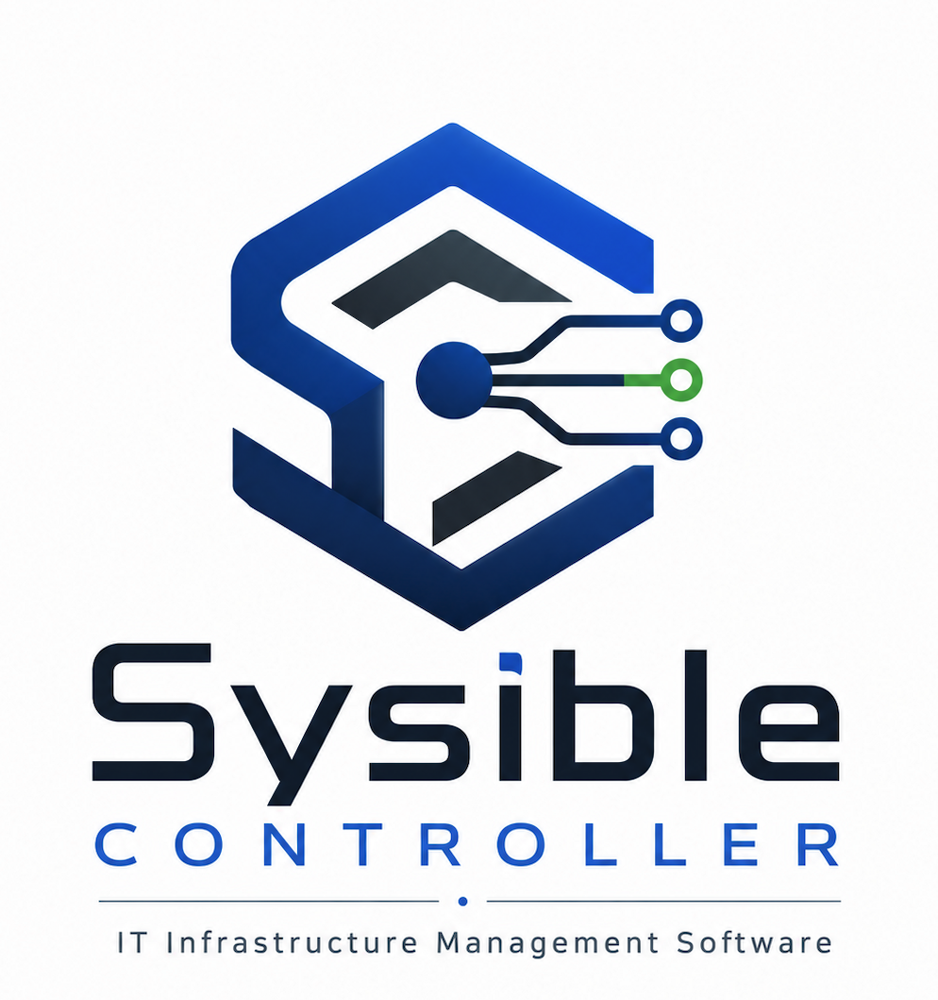

# Sysible Controller

**IT Infrastructure Management Software for Linux fleets — one console, agent or SSH, no DSL to learn.**

Sysible Controller is a self-hosted infrastructure management console for Linux system administrators and engineers. One controller, installed on a single Linux machine, gives you a single point of control over an entire fleet of Linux hosts — user and group administration, health diagnostics, service control, scheduled jobs, package and repository management, networking, storage and filesystem management, firewall and security hardening, and a live remote terminal — whether each host runs Sysible's lightweight agent or is reached directly over SSH.



## Overview

Sysible Controller is made up of two cooperating pieces:

- A **FastAPI backend** that runs as a systemd service on the controller machine, holding the fleet's inventory, credentials, and task queue in a local SQLite database.
- A **PySide6 desktop GUI** that an administrator runs to drive that backend over HTTPS.

It manages target hosts through two interchangeable mechanisms, and a single fleet can mix both freely:

- **The Sysible agent** — a small Python daemon installed on a host as its own systemd service, heartbeating back to the controller and polling for queued work.
- **Direct SSH** — for hosts that shouldn't run a persistent agent. Hand the controller SSH credentials once; it generates and installs its own key pair on the host and drives it directly from then on, including a real interactive terminal session.

Both paths feed the exact same fleet-wide tools, so day to day you don't think about which transport a given host uses.

A separate, optional **Webserver Portal** gives host operators — not Sysible administrators — a self-service way to grab the agent bundle or exchange files with the controller from a browser, without ever needing GUI or shell access.

## Why Sysible Controller

Most of the Linux infrastructure tooling landscape pulls administrators toward one of two extremes: heavyweight configuration-management platforms (Ansible, Puppet, Chef, SaltStack) that demand a DSL, a control repo, and a CI-style workflow before you can do anything — or single-host web admin panels (Webmin, Cockpit) that manage one box at a time with no real fleet-wide view. Monitoring stacks (Nagios, Zabbix, Prometheus) sit on top of both, telling you something's wrong without giving you anywhere to act on it.

Sysible Controller is built for the gap in between: **a point-and-click, fleet-wide operations console for the day-to-day work a sysadmin actually does between deployments** — locking an account, checking why a disk is full, restarting a failed service, rolling a repo out to twenty boxes, pulling a quick log tail — without writing a playbook or manifest first.

What that buys you in practice:

- **No DSL, no control repo, no apply step.** Every action is a button, not a YAML file. There's nothing to author, lint, or version before you can act on a host.
- **One tool, two transports.** Hosts that can run a persistent agent and hosts that can't (appliances, locked-down boxes, anything you'd rather not put a daemon on) sit in the same host list, behind the same buttons, instead of needing two different toolchains.
- **Detection and remediation in the same pane.** System Health & Logs doesn't just flag a WARNING/CRITICAL host — the same window lets you kill or renice the offending process, restart the failed service, or tail the relevant log, immediately, on the same host.
- **A lightweight, self-hosted footprint.** One controller machine, one SQLite database, one systemd service. No message bus, no master/minion cluster, no external database to stand up and patch.
- **Security defaults that don't require a PKI team.** Self-signed TLS scoped to every address the controller can be reached at, a dedicated SSH key pair generated and managed per fleet, single-use enrollment tokens so a leaked agent bundle can't silently enroll a second host, and an audit log of who logged in and what administrator accounts changed — all provisioned automatically at install time.
- **Self-service without handing out admin access.** The Webserver Portal lets a host owner fetch their own agent bundle or drop off a file without ever touching the admin GUI, SSH, or a credential that could be used for anything else.
- **Cross-distro by design.** The installer and every package/repository action detect `dnf`, `yum`, `zypper`, or `apt-get` at the moment they run, so a mixed RHEL/SUSE/Debian fleet is one fleet, not three separate runbooks.
- **Find any action by name.** A search box on the dashboard matches plain-language tasks — "create a user", "add a repository", "open a firewall port" — and jumps straight to the right tool (and, for User & Group Administration, the right tab), so you never have to remember which of the twelve System Administration tools owns it.
- **Dark or light, your call.** A header toggle switches the entire GUI between a dark and a light theme on the fly — every open window re-skins immediately, no restart — and remembers the choice for next time.

## Key capabilities

| Area | What it covers |
|---|---|
| **Host Enrollment** | Build and download single-use agent bundles; organize enrolled hosts into environments (Production, Staging, etc.); disenroll cleanly. |
| **Sysible Connect** | Unified list of agent- and SSH-managed hosts (with each host's IP shown inline); one-click SSH enrollment (password used once, then discarded in favor of a generated key); pop-out terminal windows opened by double-clicking a host, with **multiple concurrent sessions per host**; a real PTY terminal for SSH hosts that renders full-screen apps (`vim`, `top`, `less`) correctly and resizes with the window, with the `user@host` prompt shown green (red for root). Each terminal has a toolbar for **file upload/download** to that host, **find-in-output**, **save output**, and **font size** adjustment. Queued command execution for agent hosts; per-connection removal (drop just the SSH or just the agent side of a combined host). Agent hosts are **auto-enrolled for SSH** on enrollment, so they also get a real terminal automatically when an SSH server is present. |
| **User & Group Administration** | Create/lock/unlock/delete accounts, manage sudo and group membership, set or generate passwords against a fleet-wide policy, manage password aging and account expiration, kill active sessions, and terminate an account fleet-wide in one action — across checked hosts, with per-host result tabs. |
| **System Health & Logs** | Disk usage, memory/CPU snapshots, uptime, failed services, large-file search, log search/tail, process inspection, and a combined OK/WARNING/CRITICAL health verdict per host — with removable/install media excluded from disk scoring so a mounted ISO doesn't false-flag a healthy box. |
| **Service Management** | Start/stop/restart/reload, enable/disable at boot, status, logs, dependency view, and one-click troubleshooting for one service or every failed service fleet-wide; create new systemd services and dependency overrides from the GUI. |
| **Environmental Policies** | The password, lockout, sudo, and umask baseline pushed to managed hosts' real OS configuration — separate from the policy governing logins to the controller itself. |
| **Cron & Systemd Timers** | Manage both scheduling mechanisms side by side, with a plain-English schedule builder that writes correct cron or `OnCalendar` syntax for you. |
| **Host Software Management** | Detect the package manager, list/install/remove/update packages, query package info, verify package integrity, and clean the package cache — across `dnf`, `yum`, `zypper`, and `apt` hosts with the same buttons. |
| **Repository Management** | Add, enable, disable, and remove package repositories on one host or roll a new repo out to the entire fleet at once. |
| **Network Management** | Connectivity and DNS diagnostics, port/socket inspection and packet capture, and configuration of IP addressing, DHCP, DNS, hostname, gateways and routing, MTU, and advanced layer-2 setups (bonding, teaming, VLANs, bridges) across managed hosts. |
| **File System Management** | Create/remove directories, copy/move/rename files, manage ownership, permissions, ACLs, and links, mount/unmount/resize/repair filesystems, mount **NFS and CIFS/SMB network shares** (optionally persisted to `/etc/fstab`, with CIFS credentials kept in a root-only file), configure `/etc/fstab` and quotas, and archive/compress files. |
| **Storage Administration** | Partition, format, and monitor disks; manage LVM physical volumes, volume groups, and logical volumes; configure RAID arrays and replace failed disks; and set up swap space. |
| **Firewall Administration** | Manage firewalld zones, ports, and rich rules, plus the underlying `nftables` and `iptables` rule sets, across managed hosts. |
| **Security Administration** | Configure and troubleshoot SELinux, harden SSH access and rotate keys, review audit logs and failed logins, install security updates, set OS-level password policy, apply system hardening, run vulnerability scans, and — on the **Directory (AD / LDAP)** tab — join hosts to **Active Directory** (realmd/SSSD/adcli, with the join password kept off the command line), permit AD users/groups, enable home-dir creation, and test/configure **LDAP/LDAPS**. |
| **Backup & Recovery** | Back up and restore files (timestamped tar.gz), verify backup integrity, install scheduled backups, create and merge LVM snapshots, guide deleted-file recovery, and run a read-only disaster-recovery drill. |
| **System Boot & Recovery** | Analyze boot failures, view/change/rebuild GRUB, set a recovery boot target (rescue/emergency), configure kernel parameters, regenerate the initramfs, and list/remove old kernels. |
| **Time Synchronization** | Configure chrony/NTP and point it at chosen servers, verify synchronization, troubleshoot clock drift, and set the system time zone. |
| **Certificate Management** | Generate CSRs, install/renew/replace certificates, check expiry, verify certificate chains, and troubleshoot TLS endpoints with `openssl s_client`. |
| **Containers & VMs** | List and start/stop/restart Docker or Podman containers, view container logs and images, prune, and manage libvirt virtual machines (list/start/shutdown/destroy/info). |
| **Run A Script Across All Hosts** | Run an ad-hoc command or multi-line script on every checked host at once — the general-purpose tool for automating repetitive tasks across the fleet, with per-host output and exit code. |
| **Webserver Portal** | A separate, optional HTTPS web app for host operators to self-service agent downloads and file exchange, with full login history, active-session visibility, and a shared file pool managed from the admin GUI. |
| **Sysible Controller Settings** | Controller address/port configuration, administrator accounts, the administrator password policy, the audit log, and license/version info, all in one place. |

## Security model

- **HTTPS everywhere** — backend API, Webserver Portal, and agent check-ins all run over TLS using a self-signed certificate generated at install time, scoped to every address the controller might be reached at.
- **Admin API key** — every GUI-to-backend call is gated by a single key issued at install time.
- **Per-fleet SSH key pair** — SSH-managed hosts are authenticated with a key the controller generates and owns, not a shared or stored password.
- **Single-use enrollment tokens** — each downloaded agent bundle carries its own one-time token, so a bundle can't be silently reused to enroll an unintended host.
- **Separate password policies** — one policy governs logins to the controller's own dashboard; a separate Environmental Policy governs OS-level accounts on managed hosts.
- **Audit log** — every login attempt and administrator account change is recorded.

## Requirements

- A Linux controller host running **Debian/Ubuntu**, **RHEL/CentOS/Fedora**, or **openSUSE/SLES**, with root access for installation.
- Python 3, provisioned automatically by the installer along with the rest of the system package list.
- A desktop environment on the controller (or any machine you copy the GUI to) to run the PySide6 client — see the application menu launcher below for getting back into it without a terminal.
- Managed hosts need either outbound network access for the Sysible agent, or SSH access for the SSH-managed path. The host agent itself only depends on the `requests` library.

## Installation

```bash
# from the folder containing the project files
sudo ./install_sysible.sh
sudo sysible_controller start
```

The installer detects your package manager, deploys the project to `/opt/sysible`, sets up a Python virtual environment, generates a self-signed TLS certificate and admin API key, installs the backend as the `sysible-backend` systemd service, installs the `sysible_controller` CLI, and — on a machine with a desktop environment — adds a **Sysible Controller** entry to the application menu using the same logo shown throughout the GUI.

## First launch — create your administrator account

A fresh install ships with **no administrator account and no default password**. The first time the desktop GUI starts, it detects that no administrator exists yet and shows a **Create Administrator Account** screen instead of a login: pick a username and password (entered twice to confirm) and you're logged straight in. There is no `admin`/`admin` to log in with and no separate "now change your password" step. The password must satisfy the Administrator Password Policy in effect.

Every launch after that shows the normal login. When one administrator later adds another from Sysible Controller Settings, that new account gets a temporary password and is required to set its own on first login.

## Getting back in

Closing the dashboard window doesn't stop anything — it minimizes to a system tray icon, and the backend keeps running as a systemd service regardless. If the GUI process has fully exited (tray dismissed, "Quit" chosen, or the window manager has no tray support), there are two ways back in:

```bash
sudo sysible_controller gui
```

or, with no terminal at all, click the **Sysible Controller** icon in your application menu — it prompts graphically for the admin/root password and reopens the dashboard against the already-running backend.

## CLI reference

```
sysible_controller {start|stop|restart|status|logs|gui|destroy}
```

| Command | Root? | What it does |
|---|---|---|
| `start` | Yes | Starts the backend, confirms the API is actually reachable, then launches the GUI. |
| `stop` | Yes | Stops the GUI, the backend, the portal, and anything still bound to the backend's port. |
| `restart` | Yes | `stop` then `start`. |
| `status` | No | Backend systemd status plus GUI process state. |
| `logs` | No | Tails the backend's live log stream. |
| `gui` | Yes | Starts only the GUI — the way back in described above. |
| `destroy` | Yes | Irreversible uninstall. Requires typing `destroy` to confirm; backs up the database to `/tmp` first and never touches already-enrolled hosts. |

## Documentation

The full administrator and user guide — installation walkthrough, every screen, and a numbered recipe for every button in the product — lives in [`Sysible_Controller_Documentation.html`](Sysible_Controller_Documentation.html).

## Project structure

```
backend/        FastAPI service: routes, models, services, the SQLite layer (db.py), and the Webserver Portal app
client/         PySide6 desktop GUI: the dashboard and every popout page
host_agent/     The lightweight agent installed on managed hosts (bundled separately, requests-only)
tools/          Standalone maintenance scripts
install_sysible.sh   Installer
sysible_controller   The CLI entry point
version.py      Single source of truth for the installed version
```

## License & version

Sysible Controller is part of the Sysible Enterprise Software suite. The installed version is read from a single project-root `version.py` so the GUI's License & Version section is always accurate. See `Sysible_Controller_Documentation.html` for current licensing status.
